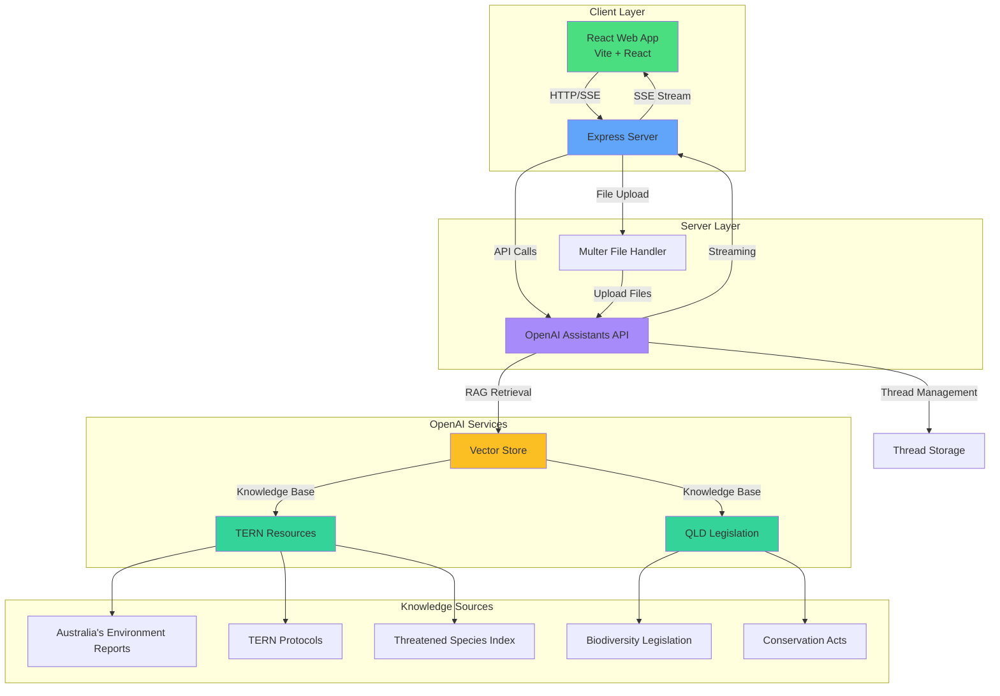

# ecoSure

**Environmental Advice Platform for Queensland, Australia**

A professional AI-powered environmental assessment platform that provides expert advice on biodiversity, conservation, and compliance for Queensland-based projects. Designed for environmental consultants, developers, and legal professionals who need accurate, evidence-based environmental assessments.

## Features

ecoSure provides comprehensive environmental intelligence through AI-powered analysis:

1. **AI Environmental Assessment** - Get instant expert analysis of your project or question using advanced AI trained on Queensland environmental data
2. **File Analysis** - Upload images, documents, and files for comprehensive environmental review
3. **Structured Reports** - Receive detailed assessment reports with:
   - Numbered environmental concerns
   - Executive summary
   - Eco-Score metrics
   - Evidence citations and references
4. **Evidence-Based Advice** - Powered by TERN (Terrestrial Ecosystem Research Network) resources and Queensland biodiversity/conservation legislation
5. **Biome-Specific Interface** - Beautiful, immersive UI with Forest, Coastal, and River biome themes
6. **PDF Export** - Export professional assessment reports as PDF documents
7. **Streaming Responses** - Real-time streaming of AI responses for immediate feedback
8. **Conversation Context** - Maintains conversation history for follow-up questions

## Key Highlights

* **Evidence-Based** - Draws from authoritative sources including TERN protocols, Australia's Environment reports, and Queensland legislation
* **Professional Reports** - Generates publication-ready assessment documents
* **Modern Interface** - Beautiful glassmorphic design with particle effects and smooth animations
* **Streaming AI** - Real-time response streaming for immediate insights
* **File Support** - Analyze images, documents, and various file types
* **Queensland-Specific** - Tailored advice for Queensland environmental regulations

## Quick Start

### Prerequisites

* Node.js 20+ and npm
* OpenAI API key
* OpenAI Assistant ID (with configured vector store containing TERN resources and QLD legislation)

### Installation

1. **Clone the repository**

```bash
git clone https://github.com/JohnJohnW/ecoSure.git
cd ecoSure
```

2. **Set up the server**

```bash
cd server
npm install
cp .env.example .env
```

3. **Configure environment variables**

Edit `server/.env` and add your credentials:

```env
OPENAI_API_KEY=sk-...
ASSISTANT_ID=asst-...
PORT=3001
STREAM_TIMEOUT_MS=120000
```

4. **Set up the web application**

```bash
cd ../web
npm install
```

5. **Configure API endpoint (optional)**

Create `web/.env`:

```env
VITE_API_BASE_URL=http://localhost:3001
```

6. **Run the application**

In separate terminals:

```bash
# Terminal 1: Start the server
cd server
npm run dev

# Terminal 2: Start the web app
cd web
npm run dev
```

The web app will be available at `http://localhost:5173` and the server at `http://localhost:3001`.

## Usage

### Getting Environmental Advice

**Text Analysis**

1. Enter your project description or environmental question in the text area
2. Click "Analyse" to receive AI-powered assessment
3. Review the structured report with environmental concerns, summary, and Eco-Score

**File Analysis**

1. Click "Choose files" to upload images, documents, or other files
2. Optionally add a description or question
3. Click "Analyse" to get comprehensive environmental review
4. The AI will analyze file contents and provide relevant environmental advice

**Exporting Reports**

1. After receiving an assessment, click "Export PDF" to generate a PDF report
2. Use the browser's print dialog to save or print the report

**Biome Themes**

Switch between Forest, Coastal, and River biome themes using the biome selector in the header for an immersive experience.

### Report Structure

Each assessment report includes:

1. **Environmental Concerns** - Numbered list of identified environmental issues
2. **Executive Summary** - High-level overview of the assessment
3. **Eco-Score JSON** - Structured metrics in a JSON block at the end
4. **References** - Citations to evidence sources used in the analysis

## Architecture

The following diagram illustrates the system architecture and data flow:



## Evidence Sources

The AI assistant is powered by comprehensive environmental knowledge bases:

### TERN (Terrestrial Ecosystem Research Network) Resources
* Australia's Environment "25 Years of Change" 2025 Report
* Australia's Environment Report 2024
* TERN Drone Protocols (data collection, RGB/multispectral, LiDAR processing)
* TERN SuperSites Vegetation Monitoring Protocols
* TERN Cal/Val Handbook
* TERN AusPlots Rangelands Survey Protocols

### Threatened Species Data
* Threatened Species Index (TSX) 2024 trend dataset + Data Dictionary
* TSX organisational dataset
* TSX aggregated Queensland dataset

### Queensland Legislation
* Biodiversity and conservation legislation
* Environmental protection acts
* Related regulatory frameworks

## Project Structure

```
ecoSure/
├── server/              # Express.js backend server
│   ├── server.js       # Main server file with SSE streaming
│   ├── package.json    # Server dependencies
│   └── .env.example    # Environment variables template
│
└── web/                # React frontend application
    ├── src/
    │   ├── App.jsx     # Main application component
    │   ├── components/ # UI components (Glass, Particles, etc.)
    │   └── theme.css   # Styling and theme definitions
    ├── package.json    # Frontend dependencies
    └── vite.config.js  # Vite configuration
```

## Development

### Running in Development

```bash
# Server (with auto-reload)
cd server
npm run dev

# Web app (with HMR)
cd web
npm run dev
```

### Building for Production

```bash
cd web
npm run build
```

The built files will be in `web/dist/`.

## Requirements

### System Requirements

* Node.js 20+
* npm or yarn
* Modern web browser

### API Requirements

* OpenAI API key
* OpenAI Assistant ID with configured vector store containing:
  * TERN resources
  * Queensland biodiversity/conservation legislation
  * Threatened Species Index data

## Technology Stack

### Backend
* **Express.js** - Web server framework
* **OpenAI SDK** - Assistants API integration
* **Multer** - File upload handling
* **CORS** - Cross-origin resource sharing

### Frontend
* **React 18** - UI framework
* **Vite** - Build tool and dev server
* **Framer Motion** - Animations
* **React Markdown** - Markdown rendering
* **Lucide React** - Icons

## License

Private project - All rights reserved.

## Legal Disclaimer

⚠️ **Queensland, Australia Only**: This application provides environmental advice specific to Queensland, Australia. Information may not apply to other jurisdictions.

This tool is intended for professional environmental assessment purposes. Users are responsible for ensuring their use complies with applicable laws and regulations. Always consult with qualified environmental professionals for critical decisions.

---

**ecoSure** - Biodiversity • Conservation • Compliance
